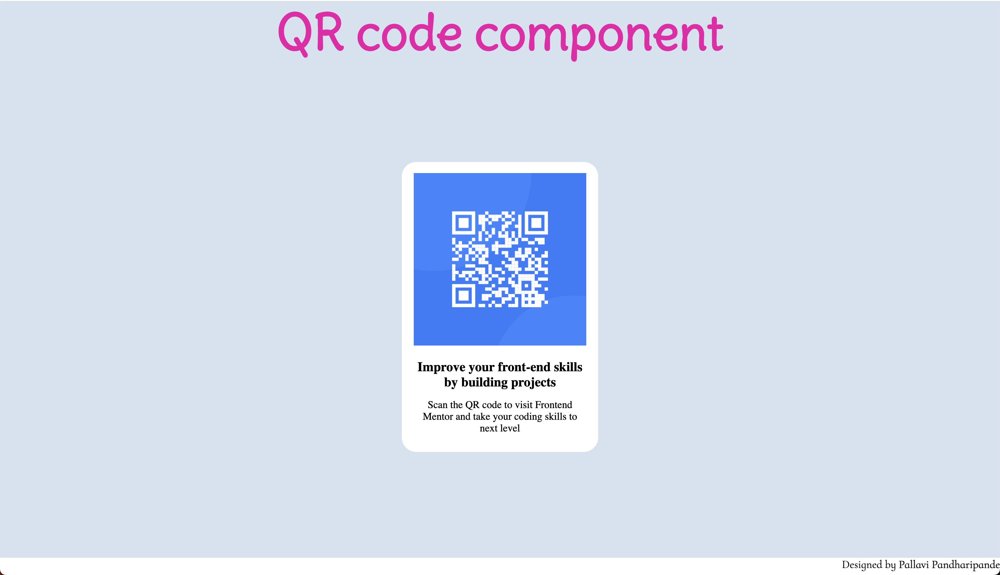
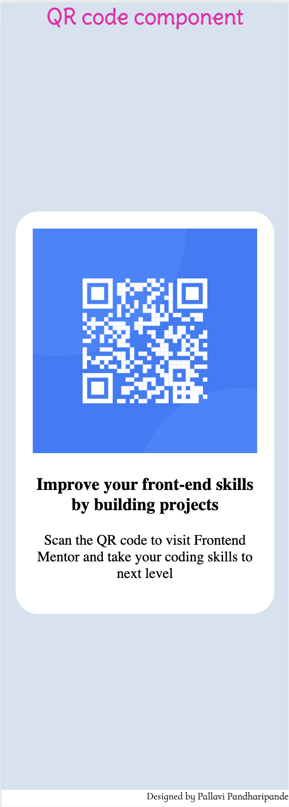

# QR code component


## Table of contents

- [Overview](#overview)
  - [Screenshot](#screenshot)
  - [Links](#links)
- [My process](#my-process)
  - [Built with](#built-with)
  - [What I learned](#what-i-learned)
  - [Useful resources](#useful-resources)
- [Author](#author)


## Overview

This project was a callenge on Frontend Mentor. I took this challenge to improve my skills required for Frontend Developer and become an expert.


### Screenshot


The above screenshot shows the view of the webpage from laptop (1710px).


The above screenshot shows the view of the webpage from mobile (320px)


### Links

- Github pages website URL: (http://pallavipandharipande.github.io/QR-code-component/)


## My process


### Built with

- HTML and CSS
- Semantic HTML5 markup
- CSS custom properties
- Media queries for responsive webpage
- CSS Flex
- clamp() function for fluid typography
- Mobile-first workflow


### What I learned

```html
<h3>Some HTML code I'm proud of</h3>
<picture>
    <source media="(min-width: 160em)" srcset="image-qr-code.png" width="700" height="700">
    <source media="(min-width: 90em)" srcset="image-qr-code.png" width="295" height="295">
    <source media="(min-width: 64em)" srcset="image-qr-code.png" width="250" height="250">
    <source media="(min-width: 48em)" srcset="image-qr-code.png" width="345" height="345">
    <source media="(min-width: 26.56em)" srcset="image-qr-code.png" width="345" height="345">
    <source media="(min-width: 21em)" srcset="image-qr-code.png" width="300" height="300">
    <source media="(min-width: 20em)" srcset="image-qr-code.png" width="250" height="250">
    
</picture>

<source media> in <picture> to make responsive webpage.
```
```css
CSS code I'm proud of

- Media Queries - This helped in making responsive webpage.
@media (max-width: 20em) {
    .cards {
        height: 28rem;
        width: 18rem;
        background-color: hsl(0, 0%, 100%);
        border-radius: 25px;
    }

    .description1 {
        margin-top: 1.2rem;
        font-size: 1.2rem;
    }

    .description2 {
        margin-top: 1.2rem;
        font-size: 1rem;
    }

}

- clamp() function - This function helped for fluid typography thereby making text responsive to different screen size
font-size: 0.7rem;
font-size: clamp(0.7rem, 0.5857142857142856rem + 0.5714285714285714vw, 1.5rem);

- With this I could use the Google fonts on my webpage
@font-face {
    font-family: Delius-Regular;
    src:url("Delius-Regular.ttf")
}
```


### Useful resources

- (https://royalfig.github.io/fluid-typography-calculator/) - This helped me with calculations required for clamp() function.

- (https://fonts.google.com/) - This helped me to download different fonts for my webpage.


## Author

- Name - Pallavi Pandharipande
- Frontend Mentor - [@pallavipandharipande](https://www.frontendmentor.io/profile/pallavipandharipande)